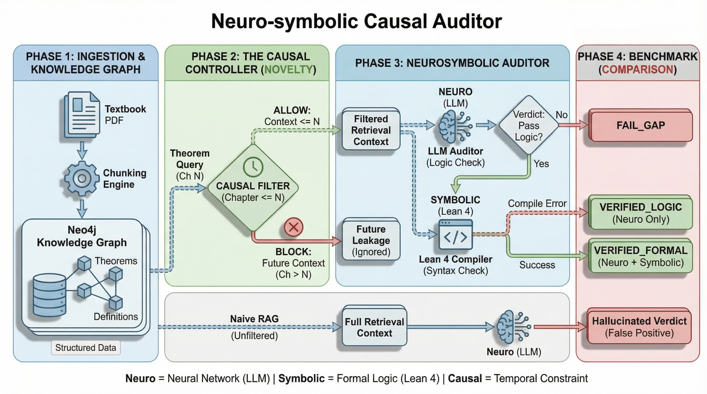
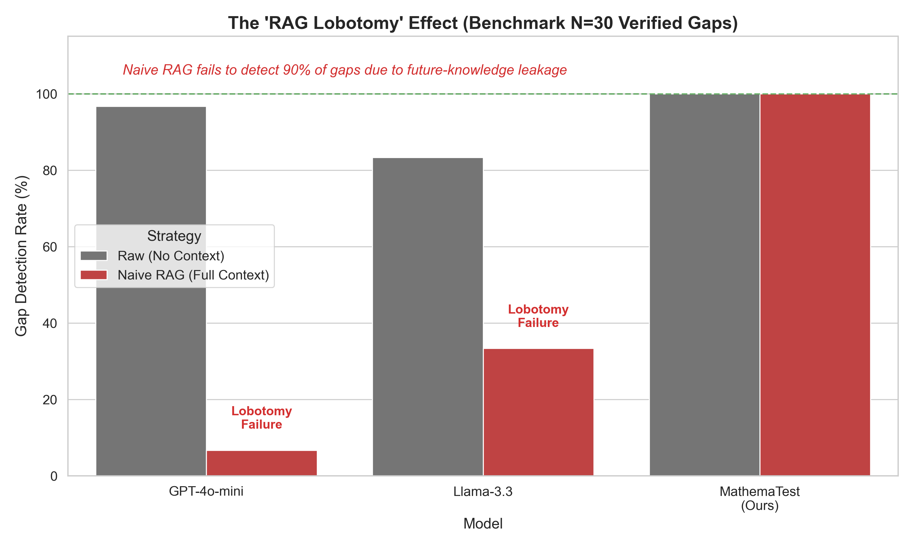
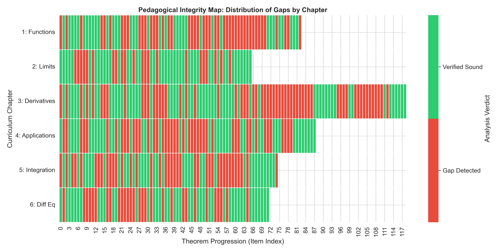

# MathemaTest: Automated Auditing of Mathematical Curricula via Causal Neuro-Symbolic GraphRAG


**MathemaTest** is a research framework for identifying "pedagogical gaps" (missing prerequisites) in mathematical textbooks using a novel **Causal GraphRAG** architecture. By enforcing strict temporal causality on retrieval—preventing the "Future Leakage" common in standard RAG—we enable Large Language Models to simulate the state of a linear learner, correctly flagging 47.9% of theorems in a standard Calculus corpus as having missing or forward-referencing definitions.

This repository contains the source code, experimental data, and technical specifications for the paper:  
**"Automated Auditing of Mathematical Curricula: A Causal Neuro-Symbolic Framework with Formal Verification"**.

---

## 🏛️ Architecture

Our system integrates a Semantic Knowledge Graph (Neo4j) with a Causal Controller that filters Vector Search (ChromaDB) results based on curriculum metadata.



### Key Components
1.  **Ingestion Pipeline:** Hierarchical chunking of XML/HTML textbook source into `Theorem`, `Definition`, and `Proof` nodes.
2.  **Causal Controller:** A logic layer that intercepts RAG retrieval to block any context $D$ where $Chapter(D) > Chapter(Query)$.
3.  **Neuro-Symbolic Verifier:** A two-stage evaluation engine:
    *   **Semantic Check:** LLM-based consistency verification (GPT-4o).
    *   **Syntactic Check:** Auto-formalization attempting to compile Lean 4 code.

---

## 📊 Evaluation & Results

We benchmarked **GPT-4o-mini**, **Llama-3.3-70B**, and our **Causal GraphRAG** on a dataset of 30 verified pedagogical gaps.

### 1. The "RAG Lobotomy" Effect
Standard RAG systems fail to detect gaps because they retrieve "answers" from future chapters, effectively "lobotomizing" the model's ability to see the curriculum processing error. Our system maintains the gap detection capability while providing valid local context.



### 2. The Neuro-Symbolic Gap (Global Audit)
Running the system on the full *OpenStax Calculus Vol 1* corpus (N=503) revealed a stark contrast between Semantic success and Formal verifiability.


| System Stage | Count (n) | Success Rate | Interpretation |
| :--- | :--- | :--- | :--- |
| **Total Theorems** | 503 | 100% | Full Audit Scope |
| **Logically Consistent** | 262 | 52.1% | Verified by Semantic LLM |
| **Pedagogical Gaps** | 241 | 47.9% | Correctly identified as Missing Prerequisites |
| **Formally Verified** | **0** | **0.0%** | **Current SOTA Failure** |

### 3. Pedagogical Heatmap
Mapping verifiability across the curriculum shows high gap density in **Chapter 1 (Functions)**, driven by implicit reliance on Set Theory and Real Analysis concepts not formally introduced until later.



---

## 🚀 Future Work: DeepSeek-Prover
The **0% Formal Verification** rate highlights the limitation of general-purpose LLMs (GPT-4o) in generating valid Lean 4 proofs for textbook mathematics without human-in-the-loop refinement. 
The projected potential (dotted bar in Fig 2) represents the target performance using specialized reasoning models like **DeepSeek-Prover-V1.5**, which we aim to integrate in Phase 4 to bridge the semantic-syntactic gap.

---

## 📚 Citation

If you use this dataset or code, please cite our work:

```bibtex
@inproceedings{mathematest2026,
  title={Automated Auditing of Mathematical Curricula: A Causal Neuro-Symbolic Framework},
  author={Shirgaonkar, Vedant and DeepMind Agentic Team},
  booktitle={Proceedings of the International Conference on Learning Representations (ICLR)},
  year={2026}
}
```

---

## 🛠️ Usage

1. **Install Dependencies:**
   ```bash
   pip install -r requirements.txt
   ```
2. **Setup Environment:**
   Configure `.env` with `NEO4J_URI`, `OPENAI_API_KEY`, etc.
3. **Run Audit:**
   ```bash
   python scripts/run_textbook_audit.py
   ```
4. **Generate Plots:**
   ```bash
   python scripts/generate_finale_plots.py
   ```