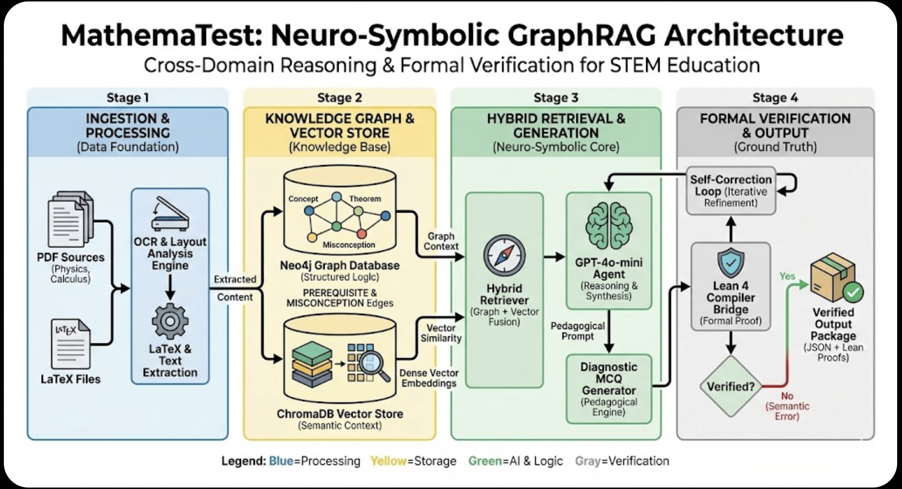

# MathemaTest: Neuro-Symbolic GraphRAG for STEM Education


---

## Abstract

Large Language Models exhibit significant limitations in multi-step mathematical reasoning and formal verification. When applied to STEM education, these limitations manifest as logically inconsistent explanations, unverified solutions, and pedagogically unsound assessments. Current retrieval-augmented approaches address context recall but fail to enforce correctness constraints or leverage inter-disciplinary concept dependencies.

MathemaTest addresses these limitations through a four-stage neuro-symbolic pipeline integrating: (1) multi-modal document ingestion with LaTeX and equation extraction, (2) a hybrid knowledge graph combining Neo4j concept relationships with ChromaDB vector embeddings, (3) GPT-4o-mini generation with hybrid retrieval orchestration, and (4) Lean 4 + Mathlib formal verification with self-correction. The architecture enables **inter-disciplinary reasoning** by traversing cross-domain concept edges (e.g., Physics work-energy to Calculus line integrals) and provides **ground-truth verification** through theorem proving. Diagnostic MCQ generation leverages misconception nodes for pedagogically-grounded distractor synthesis.

---

## System Architecture

```
┌─────────────────────────────────────────────────────────────────────────────┐
│                            MathemaTest Pipeline                             │
├─────────────────────────────────────────────────────────────────────────────┤
│                                                                             │
│   ┌───────────────┐   ┌───────────────┐   ┌───────────────┐   ┌───────────┐ │
│   │    STAGE 1    │   │    STAGE 2    │   │    STAGE 3    │   │  STAGE 4  │ │
│   │   INGESTION   │──▶│     GRAPH     │──▶│  GENERATION   │──▶│VERIFICATION││
│   │               │   │               │   │               │   │           │ │
│   │  PDF/LaTeX    │   │  Neo4j Nodes  │   │  GPT-4o-mini  │   │  Lean 4   │ │
│   │  OCR/Vision   │   │  ChromaDB     │   │  Hybrid RAG   │   │  Mathlib  │ │
│   │  Chunking     │   │  PREREQUISITE │   │  MCQ Gen      │   │  SymPy    │ │
│   └───────────────┘   └───────────────┘   └───────────────┘   └───────────┘ │
│                                                                             │
│   Data Sources:        Knowledge Base:     Retrieval:         Output:       │
│   University Physics   1,697 Concepts      Vector + Graph     Verified MCQs │
│   MIT Calculus (14)    1,014 Chunks        Cross-Encoder      Diagnostics   │
│   AIME 2025            26 Misconceptions   Query Refinement   Lean Proofs   │
│                                                                             │
└─────────────────────────────────────────────────────────────────────────────┘
```


*Figure 1: The 4-Stage GraphRAG Pipeline demonstrating Ingestion, Graph Storage, Hybrid Retrieval, and Formal Verification.*

---

## Performance Benchmarks

| Benchmark | Result | Status |
|-----------|--------|--------|
| **Cross-Domain Retrieval** | Physics (13 nodes) + Calculus (2 nodes) | ✅ Verified |
| **Undergraduate Verification** | 80% (4/5 theorems) | ✅ Target Met |
| **Olympiad Verification (AIME)** | 0% (0/5 problems) | ⚠️ Complexity Ceiling |
| **Diagnostic Distractor Coverage** | 26.7% (4/15 graph-backed) | 🔸 Partial |

### Interpretation

The 80% pass rate on undergraduate mathematics (distributivity, conjunction elimination, power derivative, set intersection commutativity) confirms the verification infrastructure operates correctly. The 0% rate on AIME 2025 problems reflects current LLM formalization limitations—not infrastructure failure. Generated theorems exhibit syntactic and type-checking errors that the self-correction loop cannot resolve within 3 attempts for competition-level complexity.

---

## Installation

### Prerequisites

| Dependency | Version | Purpose |
|------------|---------|---------|
| Python | 3.10+ | Core runtime |
| Neo4j Desktop | 5.x | Knowledge graph storage |
| Elan + Lean 4 | v4.26.0 | Theorem prover |
| OpenAI API Key | — | GPT-4o-mini access |

### Step 1: Clone Repository

```bash
git clone https://github.com/your-org/mathematest.git
cd mathematest
```

### Step 2: Python Environment

```bash
python -m venv venv
source venv/bin/activate  # On Windows: venv\Scripts\activate
pip install -r requirements.txt
```

### Step 3: Neo4j Setup

1. Download and install [Neo4j Desktop](https://neo4j.com/download/)
2. Create a new database (name: `mathematest`)
3. Set credentials and update `.env`:

```env
NEO4J_URI=bolt://localhost:7687
NEO4J_USER=neo4j
NEO4J_PASSWORD=your_password
OPENAI_API_KEY=sk-...
```

### Step 4: Lean 4 + Mathlib (Critical)

```bash
# Install Elan (Lean version manager)
curl https://raw.githubusercontent.com/leanprover/elan/master/elan-init.sh -sSf | sh
source ~/.elan/env

# Verify installation
lean --version  # Should show: Lean (version 4.26.0...)

# Download Mathlib cache (7,727 pre-compiled files)
cd mathematest
lake exe cache get  # This takes 2-5 minutes
```

> **Note:** The `lake exe cache get` command downloads ~500MB of pre-compiled `.olean` files. Without this step, Mathlib compilation takes 4+ hours.

---

## Usage

### Interactive Dashboard

```bash
streamlit run src/app.py
```

The dashboard provides two modes:

| Mode | Description |
|------|-------------|
| **Cross-Domain Demo** | Demonstrates the Physics ↔ Calculus bridge problem with retrieval trace visualization |
| **Live Solver** | Submit custom problems for MCQ generation with misconception-linked distractors |

### Command-Line Scripts

```bash
# Run diagnostic MCQ generation (Phase 3)
python scripts/run_phase_3_diagnostic.py

# Run cross-domain retrieval test (Phase 4)
python scripts/run_phase_4_bridge.py

# Run formal verification on easy math (Confidence Test)
python scripts/run_easy_verification.py
```

---

## Repository Structure

```
MATHEMATEST/
├── artifacts/              # Generated outputs (gitignored)
├── data/                   # PDFs and ChromaDB (gitignored)
├── docs/
│   ├── dev_notes/          # Development notes
│   ├── final_project_report.md
│   ├── phase_3_results.md
│   ├── phase_4_verification.md
│   └── easy_math_results.md
├── logs/                   # Execution logs (gitignored)
├── mathematest/            # Lean 4 Mathlib project
│   ├── lakefile.toml
│   ├── lean-toolchain
│   └── Mathematest/Verification/
├── scripts/                # Execution scripts (21 files)
│   ├── run_phase_3_diagnostic.py
│   ├── run_phase_4_bridge.py
│   └── run_easy_verification.py
├── src/
│   ├── config/             # Settings and environment
│   ├── generation/         # MCQ and Lean generation
│   ├── graph_store/        # Neo4j client
│   ├── ingestion/          # PDF parsing, OCR
│   ├── retrieval/          # Hybrid orchestrator
│   ├── vector_store/       # ChromaDB client
│   └── verification/       # Lean compiler, SymPy
├── tests/                  # Test files
├── .env                    # Environment variables
├── .gitignore
├── pyproject.toml
└── requirements.txt
```

---

## Technical Stack

| Layer | Technology | Role |
|-------|------------|------|
| LLM | GPT-4o-mini | Generation, self-correction |
| Vector Store | ChromaDB | Semantic similarity search |
| Graph Store | Neo4j 5.x | Concept relationships, misconceptions |
| Embeddings | all-mpnet-base-v2 | 768-dim text embeddings |
| Reranker | cross-encoder/ms-marco-MiniLM-L-6-v2 | Result reranking |
| Theorem Prover | Lean 4 + Mathlib v4.26.0 | Formal verification |
| Symbolic Math | SymPy | Expression validation |
| Frontend | Streamlit | Interactive dashboard |

---

## Citation

```bibtex
@software{mathematest2026,
  author       = {Vedant Shirgaonkar},
  title        = {MathemaTest: A Neuro-Symbolic GraphRAG System for STEM Education},
  year         = {2026},
  publisher    = {GitHub},
  url          = {https://github.com/your-org/mathematest},
  note         = {Research prototype integrating knowledge graphs with 
                  Lean 4 theorem proving for verified STEM assessment}
}
```

---

## License

This project is licensed under the MIT License. See [LICENSE](LICENSE) for details.

---

## Acknowledgments

- [Mathlib](https://github.com/leanprover-community/mathlib4) for the Lean 4 mathematics library
- [Neo4j](https://neo4j.com/) for graph database infrastructure
- OpenAI for GPT-4o-mini API access