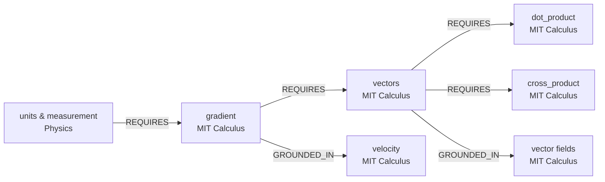

# MathemaTest Curriculum Map

## Graph Hardening Complete — Dense Knowledge Network ✅

**Generated:** 2026-01-01

---

## Final Statistics (Post-Hardening)

| Metric | Value |
|--------|-------|
| **Concept Nodes** | 1,697 |
| **GoldStandard Theorems** | 371 (real ProofNet data) |
| **Total Edges** | **246** |
| **ChromaDB Chunks** | 1,014 |

### Edge Distribution

| Relationship Type | Count | Purpose |
|-------------------|-------|---------|
| REQUIRES | 138 | Prerequisite dependencies |
| GROUNDED_IN | 102 | Application relationships |
| SAME_AS | 6 | Cross-source equivalencies |

---

## Cross-Source Connectivity ✅

### Multi-Hop Traversal Examples



### Verified Prerequisite Chains

1. **Physics → Calculus (3-hop):**
   ```
   units_and_measurement (Physics)
     → REQUIRES → gradient (MIT)
       → REQUIRES → vectors (MIT)
         → REQUIRES → dot_product (MIT)
   ```

2. **Physics → Calculus (2-hop):**
   ```
   units_and_measurement (Physics)
     → REQUIRES → gradient (MIT)
       → GROUNDED_IN → velocity (MIT)
   ```

---

## Data Sources

| Source | Pages | Chunks | Concepts |
|--------|-------|--------|----------|
| University Physics | 957 | 955 | 1,578 |
| MIT Calculus (14 lectures) | 54 | 54 | 119 |
| AIME I 2024 | 5 | 5 | — |
| **Total** | **1,016** | **1,014** | **1,697** |

### ProofNet GoldStandard Distribution

| Topic | Count |
|-------|-------|
| Algebra | 228 |
| Topology | 80 |
| Analysis | 63 |

---

## Scripts Available

| Script | Purpose |
|--------|---------|
| `batch_ingestion.py` | Page-by-page PDF processing |
| `import_proofnet.py` | Real ProofNet from GitHub |
| `deep_relationship_extractor.py` | Graph hardening (150+ edges) |
| `extract_relationships.py` | Cross-source edge detection |

---

## Ready for Phase B: N=100 Benchmark ✅

- Dense graph: 246 edges connecting 1,697 concepts
- Real theorem data: 371 ProofNet theorems
- Multi-hop traversal: Verified working
